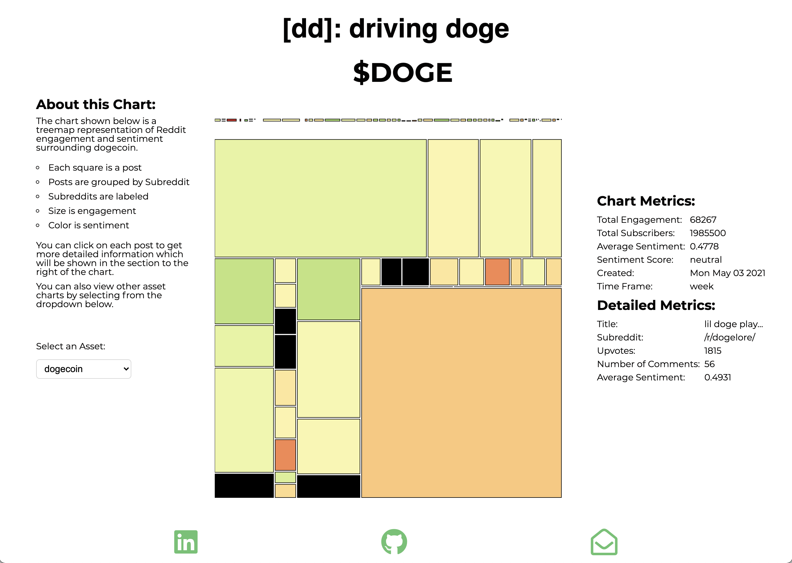

<!-- Project sheilds -->


[](https://shields.io/)
[](https://shields.io/)
[](https://shields.io/)
[![LinkedIn][linkedin-shield]][linkedin-url]

<!-- Project Logo and Header Content -->
<br />
<div align='center' >
  
  <h1 align='center' style='border:none'>DrivingDoge</h3>
  <p align='center' 
    style='display:flex; flex-direction:row; justify-content:center; align-items:center; font-weight:700'
  >
    <a href='http://drivingdoge.herokuapp.com/' style='margin:5px'>Live Site</a>
    ·
    <a href='https://github.com/theomantz/DrivingDoge/issues'style='margin:5px'>Report A Bug</a>
    ·
    <a href='https://github.com/theomantz/DrivingDoge/issues'style='margin:5px'>Request Feature</a>
  </p>
</div>

<details open='open'> 
  <summary>Table of Contents</summary>
  <ol>
    <li>
      <a href="#about-the-project">About The Project</a>
      <ul>
        <li><a href="#built-with">Built With</a></li>
        <li><a href="#the-process">The Process</a></li>
      </ul>
    </li>
    <li>
      <a href="#getting-started">Getting Started</a>
      <ul>
        <li><a href="#prerequisites">Prerequisites</a></li>
        <li><a href="#installation">Installation</a></li>
      </ul>
    </li>
    <li><a href="#roadmap">Roadmap</a></li>
    <li><a href="#contact">Contact</a></li>
    <li><a href="#acknowledgements">Acknowledgements</a></li>
  </ol>
</details>

## About The Project

<div align='center'> 
  
</div>

<b>DrivingDoge [dd]</b> is a sentiment analysis app which scrapes weekly Reddit threads relevant to a predetermined list of assets. The inspiration for DrivingDoge came about during the crypto market bull run that occured from mid 2020 through mid 2021. DogeCoin, a seemingly worthless asset, had skyrocketed in price over this time span. This project seeks to determine two things:

* Who is driving the conversation around certain assets?
* What is the nature of that conversation?

### Built With

DrivingDoge uses the following modules and frameworks:

* [Node JS](https://nodejs.org/en/about/)
* [Express JS](https://expressjs.com/)
* [D3 JS](https://d3js.org/)


### The Process

The first notable feature of DrivingDoge is the web scraping mechanism. Utilizing Axios to perform HTTP requests, and Cheerio JS to parse the HTML, DrivingDoge searches reddit using a set of parameters and a query string.

An example set of search parameters with a query string is shown below:

```js
const defaultSearch = {
  queryString: "BTC",
  sort: "relevance",
  time: "week",
  subreddit: {
    sort: "relevance",
    time: "week",
    count: 10,
  },
  post: {
    sort: "relevance",
    time: "week",
    count: 100,
  },
  comment: {
    sort: "relevance",
    time: "week",
    count: 100
  },
};
```

This is then passed as a parameter to an arrow function called on an asset HashMap:
```js
[assetClasses].forEach((assetObject) => {
  Object.values(assetObject).forEach(async (a) => {
    search = defaultSearch;
    search.queryString = a;
    await generateQuery(search);
  })
});
```

Axios is used in DrivingDoge but a fetch function was written in order to encapsulate some of the async logic:
```js
async function fetch(url) {
  return await axios.get(url)
    .then(res => res)
    .catch( e => {
      console.log(e)
      return e
    })
}
```

The starter function, `generateQuery` first checks and sanitizes the query input. This was done in anticipation of a coming feature allowing users to generate realtime queries.
```js
async function generateQuery(queryRequestObject) {
 
 const { queryString }  = queryRequestObject
  
 const {asset, isValid, errors} = validateQueryInput(queryString)


 if(!isValid) {
   return console.log(errors)
 }
```
A query document is then searched for in MongoDB, using the parameters and cutoff dates specified previously.
```js
const {
  sort,
  time,
  subreddit,
  post,
  comment
 } = queryRequestObject

 const options = {
   headers: {
     "User-Agent":
       "Mozilla/5.0 (X11; Ubuntu; Linux x86_64; rv:78.0) Gecko/20100101 Firefox/78.0",
   },
 };

 let searchHTML = await axios.get(
   `https://old.reddit.com/search/?q=${asset}&t=${time}&sort=${sort}&type=sr`,
    options
 )
 .catch(e => console.log(e))

 let today = new DateTime(Date.now())
 let cutoffDate = today.minus({ [time]: 1 })

 let queryDocument = await Query.findOne({
   query: asset, 
   createdAt: { 
     $gte: cutoffDate.toISO(),
     $lt: today.toISO()
    }, 
    'params.time': time,
    'params.sort': sort,
    'params.subreddit.count': subreddit.count,
    'params.post.count': post.count,
    'params.comment.count': comment.count,
  }).exec()
  
  if(!queryDocument) {
    
    queryDocument = new Query({
      query: asset,
     params: queryRequestObject,
   })

   queryDocument = await queryDocument.save()
   
   
  }
  if(searchHTML.status === 200) {
    let query = await constructSubreddits(queryDocument, searchHTML)
    return await constructQueryForResponse(query)
  } else {
    return null
  }


}
```
DrivingDoge then parses our the relevant subreddits, the relevant posts from each subreddit, and then the indivdual comments in each post. The comments are created recursively using the post JSON object:
```js
async function constructTopLevelComments(data, post) {

  let topLevelComments = data.children
  const commentIds = []
  for(let i = 0; i < topLevelComments.length ; i++ ) {
    let c = topLevelComments[i].data
    if(c.body) {
      try {
        
        let saved = await Comment.findOneAndUpdate({
          commentId: c.id
        }, {
          author: c.author, authorId: c.author_fullname,
          commentId: c.id, upvotes: c.ups, downvotes: c.downs,
          timestamp: c.created_utc, text: c.body, postId: post.id
        }, {
          upsert: true,
          new: true
        }).exec()
        
        commentIds.push(saved.id)

      } catch (e) {
        console.log(e)
      }
    }
    if(typeof c.replies === 'object') {
      await constructTopLevelComments(c.replies.data, post)
    }
  }
  if(commentIds.length) {
    post.comments.addToSet(...commentIds)
  }
  return await post.save()
}
```
Once all of the comments for a particular post have been saved. The post document is passed to the TensorFlow model which assigns a sentiment score. The data is then put into a proper heirarchical format for D3 Visualization and saved back to the database. 

On the frontend, once the DOM is loaded, the window dimensions are taken and passed to the initialization function. An event listener is added to a html select input for when the asset is changed by the user.
```js
document.addEventListener("DOMContentLoaded", function () {
  
  const root = document.getElementById("root");
  const input = document.getElementById("asset-input");

  

  let windowWidth = window.innerWidth;
  let windowHeight = window.innerHeight * 0.75;

  init((windowWidth), (windowHeight))


  input.addEventListener('change', (e) => {
    newTree(e.currentTarget.value, windowWidth, windowHeight)
  })

});
```

The initialization function sets the inline style attributes of a div element which then allows for the treemap visualation to be deleted and re-rendered with new data without surrounding elements collapsing in. 

```js
async function init(width, height) {

    const margins = {
      top: 10,
      right: 10,
      bottom: 10,
      left: 10,
    };

  let rems
  if(height > 900) {
    rems = 16
  } else if (height > 400) {
    rems = 14
  } else {
    rems = 12
  }
    
  d3.select("#svg-container")
    .attr('style', `min-width:${width * 0.6}px;min-height:${height + 200}px`)

  d3.select("#chart-metrics")
    .style("min-height", `${13 * rems}px`)

  d3.select('#right-sidenav')
    .style('min-width', `${width * 0.2}px`)

  const starterData = await fetchData('doge')


  drawTreemaps(starterData, width, height)
  
}
```

Lastly, it renders a treemap visualization of the sentiment data:

```js
 render() {
    
    this.appendChartInfo()


    const root = d3.hierarchy(this.data)
    
    d3.treemap()
      .size([this.width, this.height])
      .paddingTop(30)
      .paddingRight(7)
      .paddingInner(3)
      .round(true)
      (root)
      .sort((a, b) => b.value - a.value)


    this.svg
      .selectAll("rect")
      .data(root.leaves())
      .enter()
      .append("rect")
      .attr("x", function (d) {
        return d.x0;
      })
      .attr("y", function (d) {
        return d.y0;
      })
      .attr("width", function (d) {
        return d.x1 - d.x0;
      })
      .attr("height", function (d) {
        return d.y1 - d.y0;
      })
      .style("stroke", "black")
      .style("fill", (t => d3.interpolateRdYlGn(t.data.averageScore)))
      .on("click", (d => {
        this.appendPostInfo(d);
      }))
      .on('mouseover', (d => {
        this.showTitle(d)
      }))
      .on('mouseout', (d => {
        this.hideTitle(d)
      }))

    this.svg
      .selectAll("text")
      .data(
        root.descendants().filter(function (d) {
          return d.depth == 1;
        })
      )
      .enter()
      .append("text")
      .attr("x", function (d) {
        return (d.x0);
      })
      .attr("y", function (d) {
        return d.y0 + 20;
      })
      .text(function (d) {
        return d.name;
      })
      .text((d) => d.data.name)
      .attr('class', d => `subreddit-text`)
      .attr("id", d => `${d.data.name}`)

  }

}
```
<!-- Getting Started -->
## Getting Started

Getting DrivingDoge up and running is easy!

### Prerequisites

* npm
  ```sh
    npm install npm@latest -g
  ```

### Installation

1. Clone the repo: 
   ```sh
    git clone https://github.com/theomantz/DrivingDoge.git
   ```
2. Install NPM packages:
    ```sh
      npm install
    ```
3. Start the Node server:
    ```sh
      npm run start
    ```
4. Run webpack:
    ```sh
      npm run webpack
    ```
<!-- Roadmap -->
## Roadmap
See the [open issues](https://github.com/theomantz/DrivingDoge/issues) for proposed features and issues

<!-- Contact -->
## Contact

Theo Mantz - theo@mantz.io

DrivingDoge - [https://github.com/theomantz/DrivingDoge](https://github.com/theomantz/DrivingDoge)

<!-- Acknowledgements -->
## Acknowledgements

* [Reddit](https://github.com/theomantz/DrivingDoge)
* [TensorFlow JS](https://www.tensorflow.org/js)
* [Benson Ruan - Twitter Sentiment Analysis Bot](https://www.tensorflow.org/js)

<!-- Shields -->
[linkedin-shield]: https://img.shields.io/badge/-LinkedIn-black.svg?style=for-the-badge&logo=linkedin&colorB=555
[linkedin-url]: https://linkedin.com/in/theo-mantz